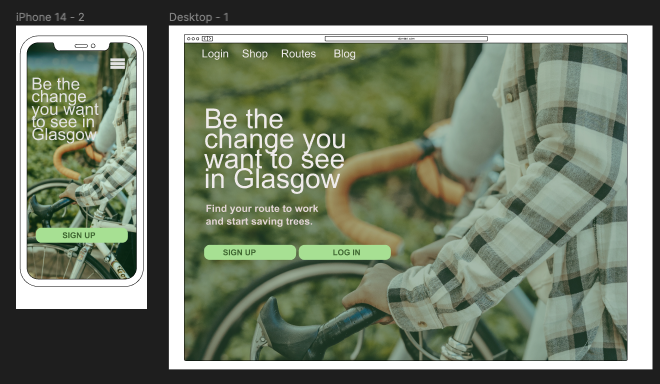
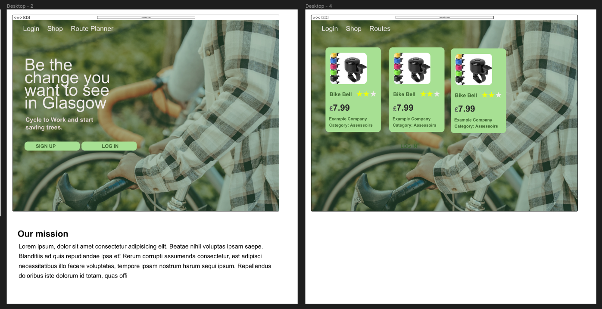

# Cycle To Work 

## Website Aim 

The purpose of this website is promote cycling to work in Glasgow. Many people are afraid of the traffic, or don't know the best routes to work. This website aims to create a platform where users can sign up, plan and share their best routes to work.  
It also contains a shop for bike assecoires, bike clothing and bikes  (B2C). 

## User Stories

| Epic           | User Story Title      | User Story                                                                                                                                                        | MoSCoW Prioritization |
| -------------- | --------------------- | ----------------------------------------------------------------------------------------------------------------------------------------------------------------- | --------------------- |
| Authentication | Sign Up               | As a website user, I can sign up using a form so that I can create an order of a bike assecoire from the shop                                                     | Must-have             |
| Authentication | Log In                | As a website user, I can log in from the main page using my credentials so that I can create an order or see status of my previous orders                         | Must-have             |
| Rating         | Rate Product          | As an authenticated website user, I can rate my previous orders so that I can express my opinion about an item to other users                                     | Must-have             |
| Rating         | Update Product Rating | As an authenticated website user, I can update or delete my ratings  so that I can edit and delete my previous rating after I have given it when I change my mind | Must-have             |
| Rating         | Approve Rating        | As an site admin, I can approve product rating  so that I can ensure fair ratings and reduce fake ratings                                                         | Must-have             |
| Checkout       | Shopping Bag          | As a website user, I can add products to my shopping bag so that I can keep looking for more products before I checkout and pay                                   | Must-have             |
| Checkout       | Update Shopping Bag   | As a website user, I can edit items in my shopping bag so that I can change the order if I change my mind and want to change the order                            | Must-have             |
| Product Search | Search by Category    | As a website user, I can search the products in the shop by Category so that I can easily and fast find the product I was searching for                           | Must-have             |
| Product Search | Order By Price        | As a website user, I can order the product list by Price so that I can find the cheapest option available for the current category                                | Must-have             |
| Product Search | Suggest Categories    | As a website user, I can see recommended/corrected search results so that I can still find my product even if I type it wrong                                     | Could-have             |
| Route Planner  | Store Routes          | As a website user, I can add coordinates for my home and work place so that I can plan a cycle route to work using the Route Planner page                         | Could-have            |
| Route Planner  | Publish Routes        | As a website user, I can change my route to work from private to public so that other cyclists can see the routes                                                 | Could-have            |
| Blog           | Publish Article       | As a site admin, I can publish an article so that other cyclists learn about tips + tricks about cycling in Glasgow                                               | Could-have            |
| Blog           | Add Comments          | As a webiste user, I can add comments to an article to express my opinion and to give tips to other cyclists and start a discussion                               | Could-have            |
| Blog           | Approve Comments      | As a site admin, I can approve comments so that users don't see inappropriate content if the comment was malicious                                                | Could-have            |

Note: to be continued - ideally we want **60%** of **must-have** stories for this iteration

## Preliminary Mockups

<table>
    <tr>
        <th> Page </td>
        <th> Mockup </td>
    </tr>
     <tr>
        <td> Landing Page </td>
        <td>   </td>
    </tr>
      <tr>
        <td> Shop </td>
        <td>   </td>
    </tr>
</table>